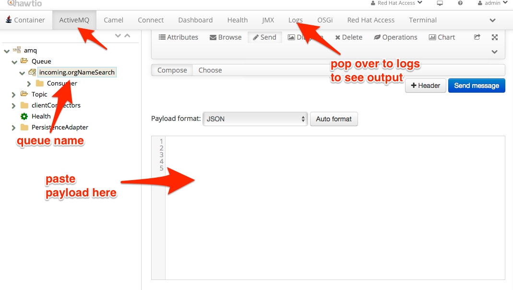

orgNameSearch REST API Provider
=============================================

This example shows how to use Servlet REST to define REST endpoints in Camel routes using the Rest DSL

This example is implemented in XML DSL in the `src/main/resources/OSGI-INF/blueprint/camel.xml` file.

JBoss Fuse
-------------------------
You will need to install this example first:
  
> mvn install

Install Derby database and JDBC connection pool in Fuse with:

> osgi:install -s mvn:commons-pool/commons-pool/1.6
> osgi:install -s mvn:commons-dbcp/commons-dbcp/1.4
> osgi:install -s mvn:org.apache.derby/derby/10.10.1.1

Install into Fuse with:

> features:addurl mvn:org.jboss.fuse.examples/apiprovider-features/1.0.0-SNAPSHOT/xml/features
> features:install apiprovider-orgNameSearchAPI

And you can see the application running by tailing the logs

  log:tail

And you can use ctrl + c to stop tailing the log.

There is a organization REST service that supports the following operations

 - GET /organization/{id} - to view a organization with the given org_id </li>
 - GET /organization/findAll - to view all organizations</li>
 - PUT /organization - to update/create an organization</li>

The view operations are HTTP GET, and update is using HTTP PUT.

From a web browser you can access the first two services using the following links

      http://localhost:8181/apiprovider/rest/orgNameSearch/123    - to view the organization with id 123
      http://localhost:8181/apiprovider/rest/orgNameSearch/findAll   - to list all organizations

From the command shell you can use curl to access the service as shown below:

    curl -X GET -H "Accept: application/json" http://localhost:8181/apiprovider/rest/orgNameSearch/123
    curl -X GET -H "Accept: application/json" http://localhost:8181/apiprovider/rest/orgNameSearch/findAll
    curl -X PUT -d "{ \"org_id\": 666, \"org_name\": \"ABC Bank\"}" -H "Accept: application/json" http://localhost:8181/apiprovider/rest/orgNameSearch
    
The above commands are duplicated for the JMS flow but with a modified context path (e.g. /rest/jms/ instead of /rest/):

    curl -X GET -H "Accept: application/json" http://localhost:8181/apiprovider/rest/jms/orgNameSearch/123
    curl -X GET -H "Accept: application/json" http://localhost:8181/apiprovider/rest/jms/orgNameSearch/findAll
    curl -X PUT -d "{ \"org_id\": 666, \"org_name\": \"ABC Bank\"}" -H "Accept: application/json" http://localhost:8181/apiprovider/rest/jms/orgNameSearch/organization

## Invoke via JMS
From the Fuse console, select the AMQ tab, and for the following operations, can invoke via JMS with the following
payload:

### Find All

    { "queryType": "SearchAll", "orgId": "", "orgName": ""}

### Find by ID

    { "queryType": "ById", "orgId": "100", "orgName": ""}

### Create new Org

    { "queryType": "NewOrg", "orgId": "100", "orgName": "Foobar"}

### Invoke via JUnit Test

`cd orgNameSearch/`

`mvn test -Dtest=org.jboss.fuse.examples.jms.EndToEndIT#testCreateNewOrganization`

If you hit any problems please let us know on the Camel Forums
  http://camel.apache.org/discussion-forums.html

Please help us make Apache Camel better - we appreciate any feedback you may
have.  Enjoy!

------------------------
The Camel riders!
